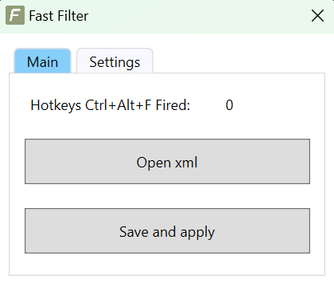
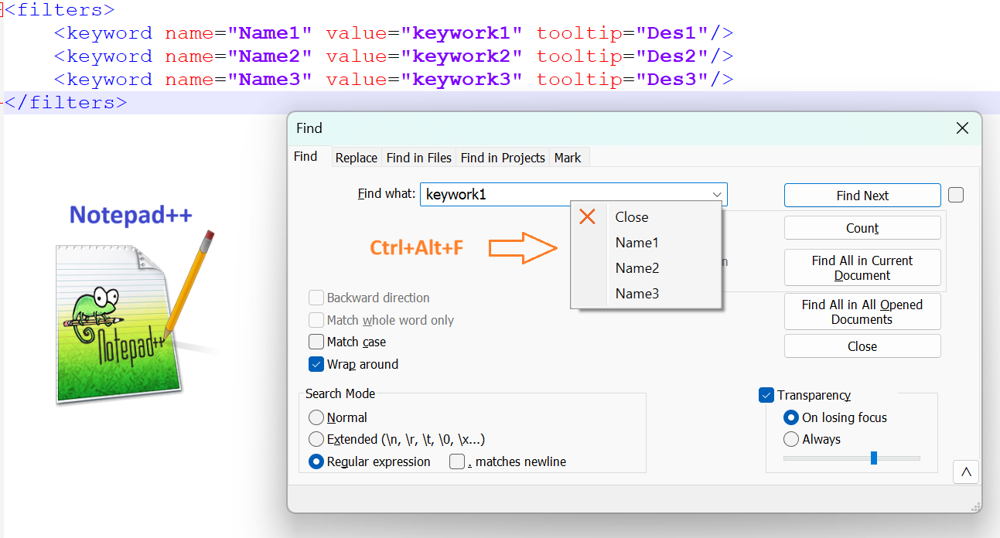

# Fast Filter

# Why a Fast Filter app?

- Fast Filter is a tool help save all your keyword and quick fill it to any `textboxs`
- All you need to do is save the keywork as an xml file and when you need to use it, just press the key combination `Ctr+Alt+F`

# Who is it for?

- Engineers who need to remember a lot of keywords for their different purposes
- Instead of having to note it somewhere and having to search for it every time you need it, Fast Filter will now do it for you.

## Download

Download the [latest release]:

 - [`FastFilter-win-x64-v1.2.zip`][direct-win64] (64-bit)

[latest release]: https://github.com/josephdinhtan/wpf_fast_keyword_filter/blob/main/BuildReleases/download/
[direct-win64]: https://github.com/josephdinhtan/wpf_fast_keyword_filter/blob/main/BuildReleases/download/v1.2/FastFilter-win-x64-v1.2.zip


## How to use it?



Open a xml file which will contain your all keywords
After change and update xml file, don't forget `Save and apply`

```xml
<?xml version="1.0" encoding="UTF-8"?>
<filters>
	<keyword name="Name1" value="keywork1" tooltip="Des1"/>
	<keyword name="Name2" value="keywork2" tooltip="Des2"/>
	<keyword name="Name3" value="keywork3" tooltip="Des3"/>
</filters>
```

Now press `Ctrl+Alt+F` to see the magic

